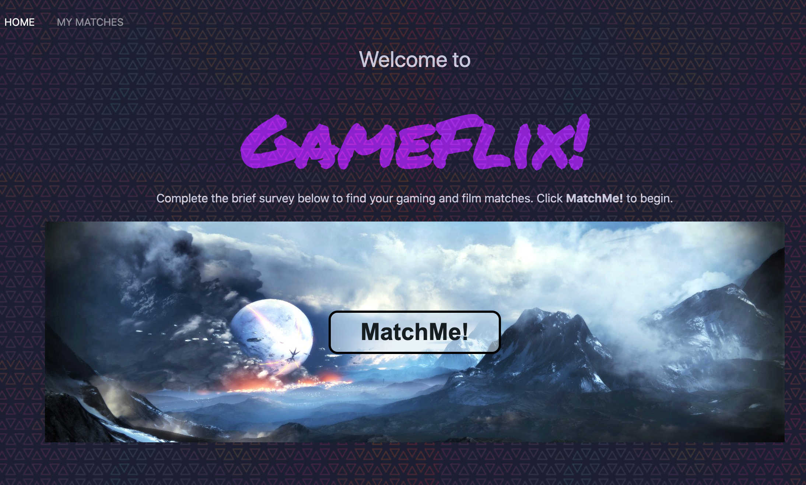
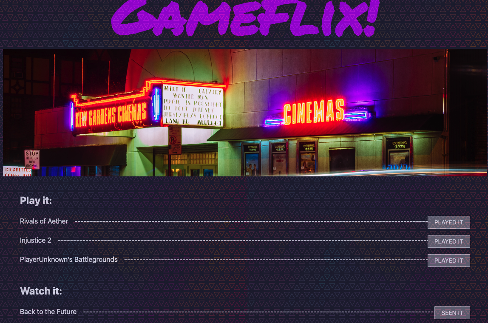

# Gameflix

Explore the github [project repo](https://github.com/TommyWillen/Gameflix/)

View the [github-pages](https://tommywillen.github.io/Gameflix/)

## Table of Contents

- [Project Description](#Project-Description)
    - [Collaborators and Roles](#Collaborators-and-Roles)
    - [Layout and Design](#event-listeners)
        - [Home Page](#local-storage)
        - [Results Page](#results-page)
        - [My Matches Page](#My-Matches-Page)
    - [Interest Quiz and Question Handlers](#highscores-page)
        - [Quiz Results Storage and Recall](#quiz-results-storage-and-recall)
        - [Character Class Determination](#character-class-determination)
    - [Ajax Call](#Ajax-call)
    - [My Matches Storage and Recall](#my-matches-storage-and-recall)
    - [Seen It Played It Buttons](#seen-it-played-it-buttons)
    - [Video Tutorial](#Video-Tutorial)
- [Installation](#installation)

- [Roadmap](#roadmap)

- [License](#license)

- [Contact Me](#contact-me)

- [Acknowledgements](#acknowledgements)

- [Easter Egg!](#easter-egg!)

## Project Description


As an avid gamer and movie-goer
I want a way to find new games and movies based on my preferences
So that I can kill boredom


### Collaborators and Roles

- Tommy: Ajax call, local storage, button handlers
- Amber:  Layout and Design for homepage and saved information
- Sandra:  Responsible for the styling  of the results page   
- Bailey: Created quiz and character roles; local storage and ajax recall; created favicon


### Layout and Design

#### Home Page  

Layout and designed Home Page using UIkit, as well as, free stock images from Freepik and Pexels. Cyberpunk inspired theme and color scheme. 

  

#### Results Page

Sandra fill out stuff here!

#### My Matches Page

Layout and designed MyMatches page using UIkit, as well as, free stock images from Freepik and Pexels. Cyberpunk inspired theme and color scheme. 

 

### Interest Quiz and Question Handlers

For the quiz, we created 8 different personalities: The Displaced Rage, The Adrenaline Addict, The Easy Going, The Wanderluster, The Bruh, The Puzzle, The Nostalgic Comedian, and The LiveLaughLove.

Each personality was considered a "bucket" in which we put specific categories (Play Types, Video Game Genres, Movie Genres).

The first question would narrow which gaming platform would be used in the AJAX call. Question two would narrow down the personality types by play type and helped determine which set of questions the user would be shown. There was a set of questions for each play type: single player, co-op player, multiplayer.

There were a total of 5 objects that contained all of the different question trees. The first handler was the matchme button which hid the button and added the questions for the first questions. The buttons on the questions had a data value that stored what console they used to be stored later and moved to the second question.

The second question buttons had another data value attached to them and added a value to a variable for if the user wanted singleplayer, multiplayer, or co-op games. This choice also moved the user into one of three different question trees based on play-type.

The final set of question buttons related to the 5 questions in the different question paths. These buttons had a data value that related to the different personalities mentioned above and would add a value to it if pressed. Once the last questions was pressed, the object that contained the user inputed data values would be sorted and the value with the highest score would be sorted as first and be the users choosen personality. This personality bucket would then be saved for the ajax call.

#### Quiz Results Storage and Recall

Based on the seven question the user selected in the quiz a object was created. This object called "resultsObj" contained all of the data for the user including values for the ajax call and personality information. It was then stored into local storage so it could be called upon in the results page.

For the AJAX recall, we used the information saved in local storage to get the "Stored-Character-Class" object. We used the information in the object to create variables (e.g. gamePlatform, gamePlayType, etc) that could be used in the API URLs.

#### Character Class Determination

Still using the "Stored-Character-Class" object from local storage, we were able to pull the name and description of the user's personality result. When the user finishes taking the quiz, they will be presented with the name of their personality along with the description.

### Ajax Call

For the ajax call, the data that was pulled from local storage was added to the query url and used to get the information from the database and display it in the results page. There were two ajax calls total made (one for each database). In each call the results were sorted by popularity and then the top 20 or 30 results were randomly selected from. The TMDB call was a little trickier because you could only request one genre at a time. Since the personality buckets we created included multiple genres, we created a random generator that would reandomly select one of the genres for the call.

### My Matches Storage and Recall

In the results section we added the option for the user to refresh their results as well as save their results. We did this so the user to request a different game/movie choice if they had already played it/watched it. The save buttons created two arrays (one for movies and one for games) that saved the name of the movie/game. This was then stringified and stored into local storage to be called in the myMatches page.

### Seen It Played It Buttons

In the My Matches page the saved movie and game matches that were stored were displayed and given a seen it/played it button. These buttons allowed the user to remove any matches that they have already played from their list.

### Video Tutorial

Click the image to view the video feature tutorial:

[](https://youtu.be/zNPXIwiTRyg)

## Installation

Prerequisites\: None

Simply clone it from the repo\:

```
clone git@github.com:TommyWillen/Gameflix.git
```

## Roadmap

We would like to eventually include embeded video of the movie trailer and game trailer

## License

[License](https://github.com/TommyWillen/Gameflix/blob/main/LICENSE)

## Contact Me

Tommy Willen
- [Email](TommyAllen1215@gmail.com)
- [Github Page](https://github.com/TommyWillen)
- [LinkedIn](https://www.linkedin.com/in/tommy-willen-12867b1b3/)

Bailey Myers
- [Email](baileymyers96@gmail.com)
- [Github Page](https://github.com/baileymyers)
- [LinkedIn](https://www.linkedin.com/in/bailey-myers-9a39a3b8/)  

Amber Alex Lee
- [Email](lee.amber.alex@gmail.com)
- [Github Page](https://github.com/lee-amber-alex)
- [LinkedIn](www.linkedin.com/in/leeamberalex)


## Acknowledgements

- Dan Mont-Eton\: For the calm and patient support he provided in understanding our code and "talking us off the ledge" when I we had git/merge conflicts.